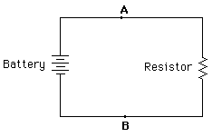

有人觉得并发开的越多性能就越高，这是一种比较直观的想法，但看完这篇文章以后你会改变这个想法，更本质的理解并发的意义。

## 负载 payload



在电路学当中，我们一开始就会接触一个单词负载，所有的电路都需要串联负载，一个小小的电阻就是负载，一个热水壶就是负载，没有负载电流就会直接穿透，所以在任何电路中都需要一个负载来消耗能量（功率），才能安全的用电。在电路学中的并发就是并联多个负载一起工作。所以我们家里的电器设备都在一起工作，每个电器就是一个负载，整个家庭的电路就是一个大的并发。

所以我在编程当中把并发中的代码也抽象成负载。并发就是在跑负载，例如一段代码执行时间是 0.1 秒，那就被称作 0.1 秒的负载，那么 1 秒时间 1 颗 cpu 可以完成的数量就是并发的完成的数量，我们希望这个数量是越多越好，但实际上负载本身意味着完成的数量是有极限的。

## 空载 纯负载 实际负载

同样是 0.1 秒的执行时间，但我们可以把负载细分为空载、纯负载和实际负载（一部分空载一部分负载的混合体）

### 空载

```go {github="https://github.com/langwan/chigo/blob/main/Concurrent/Payload/payload.go"}
func payload() {
	time.Sleep(100 * time.Millisecond)
}
```

这端代码被称为空载，虽然从人的时间上这端代码跑了 0.1 秒的时间，但从操作系统的角度来说，这段代码什么也没干，当我们去并发这样的代码，它会有极高的完成数，这是一种极端的形式，叫空载。

### 纯负载

```go {github="https://github.com/langwan/chigo/blob/main/Concurrent/Payload/payload2.go"}
func payload2() {
	for i := 0; i < 2700000; i++ {
		strings.Split("abc", "b")
	}
}
```

这段代码被称为纯负载，一次跑 270 次的字符串拆分，人的角度执行时间也是 0.1 秒，但从操作系统的角度来说，这段代码是纯粹的负载，实实在在的工作了 0.1 秒的时间，它会有最低的完成数，这是一种极端的形式，叫纯负载。

### 真实负载

```go {github="https://github.com/langwan/chigo/blob/main/Concurrent/Payload/payload3.go"}
func payload3() {
	for i := 0; i < 1000000; i++ {
		strings.Split("abc", "b")
	}
	time.Sleep(60 * time.Millisecond)
}
```

真实负载就是我们写程序时间的一种情况，一个被并发的函数内，有一部分纯负载需要 cpu 实际去工作，还有一部分空闲，包括 sleep，io 读写的等待时间、网络开销这些都是空载。

所以这就像一个洗碗的海绵，你需要挤压海绵把空闲的部分的挤出去，看看实际上的纯负载有多少，这个纯负载制约了并发的实际完成数量。

从上面的代码看有 0.04 秒的时间是纯负载，道理上来说完成数要比 payload2()高出一部分，但绝对小于 payload()，没有任何有用的代码会超越 payload()的完成数，因为那是理想化的空载。

## 测试我们的想法

我们使用 [chiab](https://github.com/langwan/chiab) 来测试我们的想法，如果你用 go 自带的 Benchmark 不一定可以测试出我们需要的效果，至少默认参数下比较难。这是另外一个话题。

测试方法 100 个并发同时去完成 100 个请求，我们看 payload()、payload2()、payload3()的并发完成数是怎样的。

电脑是

Mac mini (M1, 2020) Apple M1 16 GB CPU 数量是 8 核


### 空载

```output {title="payload()"}
Complete requests:       100
Requests per second:     985.011009 [#/sec]
Time taken for tests:    101.521708ms
Failed requests:         0
P90:                     101.332334ms
Max time:                101.333833ms
Min time:                101.08975ms
Concurrency Level:       100
```

完成数是每秒 985 个请求

### 纯负载

```outout {title="payload2()"}
Complete requests:       100
Requests per second:     13.052173 [#/sec]
Time taken for tests:    7.661559209s
Failed requests:         0
P90:                     7.623898834s
Max time:                7.659113917s
Min time:                5.445947791s
Concurrency Level:       100
```

完成数是每秒 13 个。

### 真实负载

```output
Complete requests:       100
Requests per second:     47.601869 [#/sec]
Time taken for tests:    2.100757833s
Failed requests:         0
P90:                     2.086988042s
Max time:                2.099134666s
Min time:                1.170423917s
Concurrency Level:       100
```

完成数是每秒 47 个。

如果我们调整真实负载的比例，让空载更多，让纯负载更少完成数就会变的更多。

```go
func payload3() {
	for i := 0; i < 500000; i++ {
		strings.Split("abc", "b")
	}
	time.Sleep(80 * time.Millisecond)
}
```

```
Complete requests:       100
Requests per second:     89.426171 [#/sec]
Time taken for tests:    1.118240875s
Failed requests:         0
P90:                     1.106005458s
Max time:                1.116477417s
Min time:                516.223916ms
Concurrency Level:       100
```

## 开更多的并发

我们现在去尝试一下 200 并发，跑 200 个请求。

### 空负载

```go
Complete requests:       200
Requests per second:     1963.275287 [#/sec]
Time taken for tests:    101.870584ms
Failed requests:         0
P90:                     101.298083ms
Max time:                101.31475ms
Min time:                101.037625ms
Concurrency Level:       200
```

完成数还在提高，因为空负载并没有做任何事，你的并发越高完成数就越大。

### 纯负载

```output
Complete requests:       200
Requests per second:     18.681389 [#/sec]
Time taken for tests:    10.705842042s
Failed requests:         0
P90:                     10.628505791s
Max time:                10.703314375s
Min time:                5.770637625s
Concurrency Level:       200
```

100 并发的时候完成数是 13 个，200 并发的时候是 18 个，这就像挤压成团的海绵，已经没有多少可以窄的价值了。这个完成的数量，基本上是恒定的，因为这就是纯负载。

### 真实负载

```output
Complete requests:       200
Requests per second:     48.123374 [#/sec]
Time taken for tests:    4.155984583s
Failed requests:         0
P90:                     4.0884645s
Max time:                4.151111959s
Min time:                2.062492334s
Concurrency Level:       200
```

## 代码地址

[https://github.com/langwan/chigo/tree/main/Concurrent/Payload](https://github.com/langwan/chigo/tree/main/Concurrent/Payload)

## 视频地址
